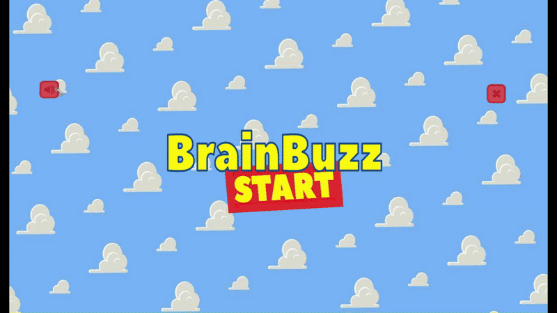

# Educational Kids Game - Unity Project

## Overview
This project is an **educational game** designed to teach children basic English concepts, including the alphabet and numbers. The game aims to make learning fun and engaging through interactive gameplay, quizzes, and scoring mechanisms.

---

## Demo



---

## Features

1. **Alphabet Learning**
   - Interactive gameplay to help children learn the English alphabet.
   - Sound effects for each letter to reinforce learning.

2. **Number Learning**
   - Fun activities to teach numbers.
   - Visual and auditory aids for better understanding.

3. **Quizzes**
   - Multiple-choice quizzes to test and reinforce knowledge of alphabets and numbers.
   - Scoring system to motivate and track progress.

4. **Character Selection**
   - Players can choose different characters to make the learning experience personalized and exciting.

5. **Sound Effects**
   - Engaging sound effects for buttons, correct/incorrect answers, and background music.

---

## Game Mechanics

### Gameplay
- Players interact with letters and numbers by clicking objects.
- Audio cues provide feedback for correct and incorrect answers.

### Quizzes
- A series of questions designed to test understanding.
- Players receive scores based on correct answers, encouraging them to replay and improve.

---

## Technical Details

### Requirements
- Unity Version: **2018.2 or later**
- Platform: Windows, MacOS, or WebGL.

### Installation
1. Clone or download the repository.
   ```bash
   git clone https://github.com/Aya-Abdellatif/educational-kids-game.git
   ```
2. Open the project in Unity.
3. Build and run for your preferred platform.

---

## How to Play

1. **Start the Game**
   - Launch the game and choose "Learn Alphabet" or "Learn Numbers" from the main menu.

2. **Learning Mode**
   - Interact with objects on the screen to hear and see letters or numbers.

3. **Take a Quiz**
   - Answer the questions by selecting the correct options.

4. **Track Progress**
   - View your score at the end of each quiz.

---

## Contributors
- [Aya Abdellatif] - Project Developer
- [Enas Ikram] - Project Developer
---

## Contact
For any inquiries or feedback, please contact:
- Email: ayaabdllatif112@gmail.com

---

### Thank you for using our game!🙌🏻

---
